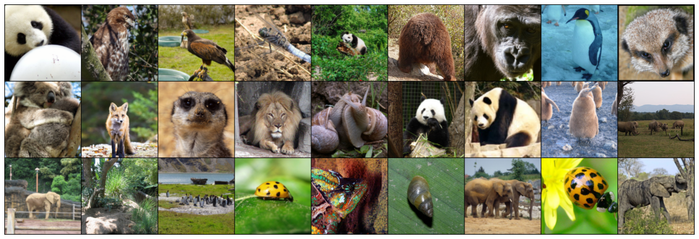

### Designed a Residual Network to classify animals from the NaturalImageNet dataset.

  

Steps involved:
1. Designing the data augmentation
2. Designing the model
3. Analysing the model performance and discussing engineering decisions made
